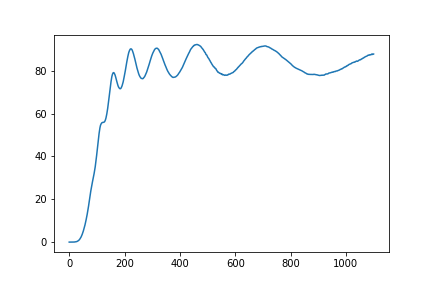
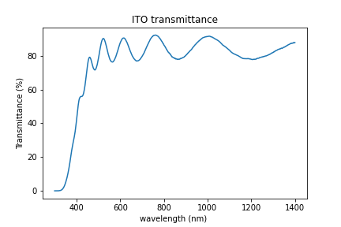
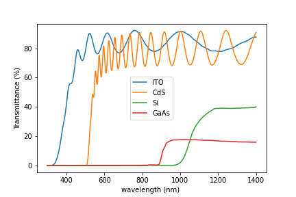

## Use the `pyplot` library from `matplotlib` for creating effective visualizations

The mathematician Richard Hamming once said, "The purpose of computing is insight, not numbers," and
the best way to develop insight is often to visualize data.  Visualization deserves an entire
lecture of its own, but we can explore a few features of Python's `matplotlib` library here.  While
there is no official plotting library, `matplotlib` is the _de facto_ standard.  Let's import it - 

~~~
import matplotlib.pyplot
~~~
{: .language-python}

Everytime we use a function from this library - say the `plot` function we need to pre-pend it with the library name `matplotlib.pyplot`. Typing `matplotlib.pyplot.plot` many times is quite repetative and can lead easily to typo-mistakes. 
Instead we can import the library with a shortened nickname:

~~~
import matplotlib.pyplot as plt
~~~
{: .language-python}

Now each time we want to use the `plot` function we can call it using `plt.plot` instead.

> ## Some IPython Magic
>
> If you're using an IPython / Jupyter notebook,
> you'll need to execute the following command
> in order for your matplotlib images to appear
> in the notebook when `show()` is called:
>
> ~~~
> %matplotlib inline
> ~~~
> {: .language-python}
>
> The `%` indicates an IPython magic function -
> a function that is only valid within the notebook environment.
> Note that you only have to execute this function once per notebook.
{: .callout}

First, as in earlier tutorials, let's read-in the cleaned data and assign the wavelengths and transmittance data to variables:

~~~
numpy.loadtxt("./data/transmittance_cleaned.csv")
wavelengths = data[:,0]
ITO_transmittance = data[:,1]
CdS_transmittance = data[:,2]
Si_transmittance = data[:,3]
GaAs_transmittance = data[:,4]
~~~
{: .callout}

# Basic plots can be generated quickly with matplotlib

Let's take a look at the transmittance data for the ITO:

~~~
plt.plot(ITO_transmittance)
plt.show()
~~~
{: .language-python}

Here we have asked
asked `matplotlib.pyplot` (which we've shortened to `plt`) to create and display a line graph of the ITO transmittance values.

At the moment the x-axis has no physical significance; it is an integer range. 
Instead we can ask `matplotlib.pyplot` to plot a line graph of transmittance vs wavelength.
We can also add a labelled axes and a title.

~~~
plt.plot(wavelengths,ITO_transmittance)
plt.xlabel("wavelength (nm) ")
plt.ylabel("Transmittance (%)")
plt.title("ITO transmittance")
plt.show()
~~~

We can easily extend this to plot multiple lines. We also each line and create a legend so we can differentiate between each material.

~~~
plt.plot(wavelengths,ITO_transmittance,label='ITO')
plt.plot(wavelengths,CdS_transmittance,label='CdS')
plt.plot(wavelengths,Si_transmittance,label='Si')
plt.plot(wavelengths,GaAs_transmittance,label='GaAs')
plt.legend()
plt.xlabel("wavelength (nm) ")
plt.ylabel("Transmittance (%)")
plt.show()
~~~

### To group similar plots we use a figure and subplots

As an alternative to having multiple lines on a single plot, you can group multiple plots in a single figure using subplots.
This script below uses a number of new commands. The function `matplotlib.pyplot.figure()`
creates a space into which we will place all of our plots. The parameter `figsize`
tells Python how big to make this space. Each subplot is placed into the figure using
its `add_subplot` [method]({{ page.root }}/reference/#method). The `add_subplot` method takes 3
parameters. The first denotes how many total rows of subplots there are, the second parameter
refers to the total number of subplot columns, and the final parameter denotes which subplot
your variable is referencing (left-to-right, top-to-bottom). Each subplot is stored in a
different variable (`axes1`, `axes2`, `axes3`, `axes4`). Once a subplot is created, the axes can
be titled using the `set_xlabel()` command (or `set_ylabel()`).
Here are our four plots (one for each material) in a 2x2 arrangement:

~~~
import numpy
import matplotlib.pyplot as plt

fig = plt.figure(figsize=(10.0, 10.0))

axes1 = fig.add_subplot(2, 2, 1)
axes2 = fig.add_subplot(2, 2, 2)
axes3 = fig.add_subplot(2, 2, 3)
axes4 = fig.add_subplot(2, 2, 4)

axes1.plot(wavelengths,ITO_transmittance)
axes1.set_ylabel("Transmittance (%)")
axes1.set_title("ITO")

axes2.plot(wavelengths,CdS_transmittance)
axes2.set_title("CdS")
axes2.sharey(axes1)

axes3 .plot(wavelengths,Si_transmittance)
axes3.set_xlabel("wavelength (nm) ")
axes3.set_ylabel("Transmittance (%)")
axes3.set_title("Si")

axes4.plot(wavelengths,GaAs_transmittance)
axes4.set_xlabel("wavelength (nm) ")
axes4.set_title("GaAs")
axes4.sharey(axes3)

fig.tight_layout()

plt.savefig('./group_transmittance.png')

plt.show()
~~~
{: .language-python}

The [call]({{ page.root }}/reference/#function-call) to `tight_layout` improves the formatting (sub-plot placement) of the figure
The [call]({{ page.root }}/reference/#function-call) to `savefig` saves our figure to the file `group_transmittance.png`.

# There are many ways to plot and customise plots using matplotlib

We are only touching the surface of plotting with matplotlib.
There are hundreds of different plots, and thousands of ways to customise your plot.
A good starting point for exploring the options is by looking online: The [official matplotlib gallery](https://matplotlib.org/2.0.2/gallery.html) and the [Python graph gallery](https://www.python-graph-gallery.com/matplotlib/) have lots of code examples.

> ## Plot Scaling
>
> Why do all of our plots stop just short of the upper end of our graph?
>
> > ## Solution
> > Because matplotlib normally sets x and y axes limits to the min and max of our data
> > (depending on data range)
> {: .solution}
>
> If we want to change this, we can use the `set_ylim(min, max)` method of each 'axes',
> for example:
>
> ~~~
> axes3.set_ylim(0,6)
> ~~~
> {: .language-python}
>
> Update your plotting code to automatically set a more appropriate scale.
> (Hint: you can make use of the `max` and `min` methods to help.)
>
> > ## Solution
> > ~~~
> > # One method
> > axes3.set_ylabel('min')
> > axes3.plot(numpy.min(data, axis=0))
> > axes3.set_ylim(0,6)
> > ~~~
> > {: .language-python}
> {: .solution}
>
> > ## Solution
> > ~~~
> > # A more automated approach
> > min_data = numpy.min(data, axis=0)
> > axes3.set_ylabel('min')
> > axes3.plot(min_data)
> > axes3.set_ylim(numpy.min(min_data), numpy.max(min_data) * 1.1)
> > ~~~
> > {: .language-python}
> {: .solution}
{: .challenge}

> ## Moving Plots Around
>
> Modify the program to display the four plots next to each other
> instead of in a 2x2 arrangement.
>
> > ## Solution
> > You need to adjust the following code:
> > ~~~
> > import numpy
> > import matplotlib.pyplot as plt
> > 
> > fig = plt.figure(figsize=(20.0, 5.0))
> > 
> > axes1 = fig.add_subplot(1, 4, 1)
> > axes1 = fig.add_subplot(1, 4, 2)
> > axes1 = fig.add_subplot(1, 4, 3)
> > axes1 = fig.add_subplot(1, 4, 4)
> > 
> > ~~~
> > {: .language-python}
> {: .solution}
{: .challenge}
